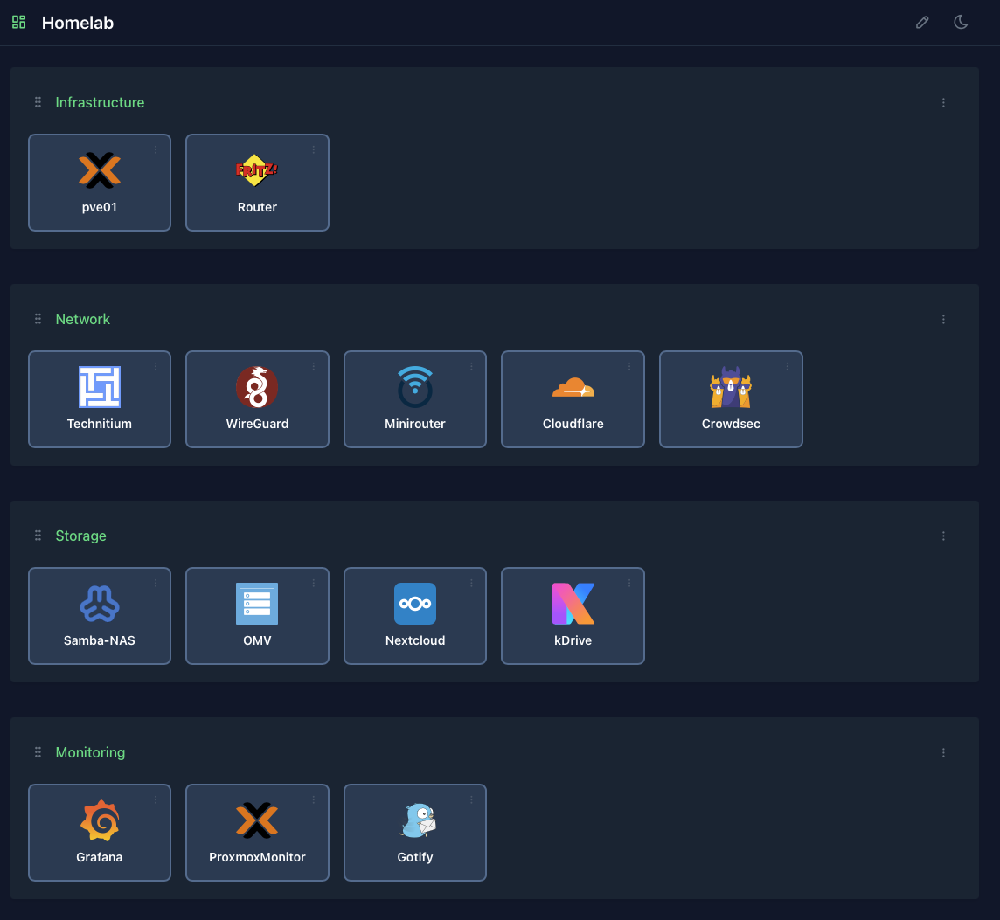

# MiniDashboard

A deliberately simple, lightweight dashboard for self-hosted services and homelabs.



## Why MiniDashboard?

MiniDashboard is designed for people who want a clean start page for their self-hosted services without running a large dashboard platform.

- No database
- No Node.js
- No build system
- Simple JSON configuration
- Local icons
- Light and dark themes
- Small and fast
- Docker support
- Native Debian LXC support

If all you need is a clean start page for the services in your homelab, MiniDashboard keeps it simple.

## Deployment

MiniDashboard can be deployed in two ways.

### Docker

Run MiniDashboard as a lightweight Docker container with persistent configuration and icons.

The dashboard is available on port 8080.

See the complete [Docker installation guide](docs/docker.md).

### Debian LXC

MiniDashboard can also run directly in a Debian LXC without Docker.

The LXC installation uses Python 3, FastAPI, Uvicorn and systemd.

Application files are stored in `/opt/minidashboard` and persistent data in `/var/lib/minidashboard`.

No Docker daemon is required.

This makes MiniDashboard suitable for a small dedicated LXC on a Proxmox host.

See the complete [LXC installation guide](docs/lxc.md).

## Features

- Custom dashboard title
- Groups for organizing services
- Drag and drop groups
- Drag and drop tiles
- Move tiles between groups
- Custom service URLs
- Local SVG and PNG icons
- Fetch icons directly from the configured icon source
- Light and dark themes
- Light and dark icon variants
- Optional display of service URLs
- JSON-based persistent configuration
- No database required

## Quick start

### Docker

The repository contains a ready-to-use Docker configuration.

```bash
git clone https://github.com/jps-user/minidashboard.git
cd minidashboard
docker compose up -d
```

The default port is 8080.

Persistent data is stored in `./data`.

For details, see [docs/docker.md](docs/docker.md).

### LXC

For a native Debian LXC installation, see [docs/lxc.md](docs/lxc.md).

The LXC installation keeps application files and persistent data separate:

- `/opt/minidashboard`
- `/var/lib/minidashboard`

The application is managed by systemd and starts automatically with the LXC.

## Configuration

MiniDashboard uses a simple JSON configuration file.

An example configuration is included as `config.example.json`.

Example:

```json
{
  "title": "My Homelab",
  "showUrls": true,
  "groups": [
    {
      "id": "infrastructure",
      "name": "Infrastructure",
      "tiles": [
        {
          "id": "proxmox",
          "title": "Proxmox",
          "url": "https://192.0.2.10:8006/",
          "icon": "proxmox"
        }
      ]
    }
  ]
}
```

See the complete [configuration documentation](docs/configuration.md).

## Icons

MiniDashboard supports local SVG and PNG icons.

The default icon source is:

`https://cdn.jsdelivr.net/gh/homarr-labs/dashboard-icons/svg`

Icons are stored locally after they are fetched.

This means the dashboard does not need to contact the icon source every time an icon is displayed.

### Light and dark icon variants

When an icon source provides separate light and dark variants, MiniDashboard stores both variants locally and switches between them when the dashboard theme changes.

If an icon does not switch correctly between light and dark mode, fetch the icon again and reload the browser page.

Theme changes therefore do not require another network request for the icon.

## Environment variables

MiniDashboard supports the following environment variables:

- `ICON_SOURCE_URL`
- `ICON_METADATA_URL`
- `DATA_DIR`

`DATA_DIR` controls where persistent configuration and icons are stored.

For Docker this defaults to `/app/data`.

For the documented LXC installation it is `/var/lib/minidashboard`.

An example environment file is included as `.env.example`.

## Security

MiniDashboard is intended for use on a trusted network.

The application currently does not provide:

- User accounts
- Authentication
- Authorization
- Multi-user management

Do not expose the administration interface directly to the public Internet without placing an appropriate authentication and access-control layer in front of it.

Tile URLs are validated by the backend and icon paths are restricted to valid local icon names.

## Technology

MiniDashboard is intentionally built from a small set of components:

- Python 3
- FastAPI
- Uvicorn
- Pydantic
- Requests
- HTML5
- Vanilla JavaScript
- Bootstrap
- Tabler
- SortableJS

There is no Node.js build process and no database.

## Project status

MiniDashboard 0.1.0 is the first public release.

The project is intentionally kept small and focused. More functionality may be added over time, but keeping the application lightweight and easy to understand is a core goal.

## License

MiniDashboard is released under the MIT License.

See [LICENSE](LICENSE).
